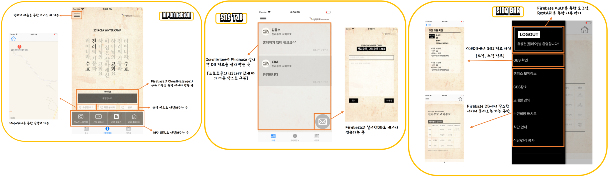

# CBACampProject

- Flatform : IOS Application
- CBA수련회 때 사용할 IOS앱을 개발하는 브랜치입니다.
- 18년 여름수련회까지의 개발했던 버전을 그대로 옮겨 새로 작업합니다.

- **18_여름수련회**
  * Firebase를 활용한 실시간 DB연동
  * Firebase를 활용한 노티기능 구현
  * Cocoapod, Mapkit 등을 활용한 기본 App흐름 구현
  * 기본적인 스토리보드 흐름 구현
  * Appstore검색 : CBARetreat
  
- **19_겨울수련회**
  * AppStore검색 : 성락교회CBA
  * Firebase Auth를 활용한 회원가입 및 로그인 구현
  * 자체Server와 연동하여 DB를 받을 수 있도록 구현 (Restful API)
  * 자체DB와 파싱해서 자신의 조장 조원 확인 가능
  * Firebase와 연동한 뉴스피드 기능 구현 및 글쓰기 기능 추가
  * 19_겨울 수련회에 맞는 디자인 업데이트
  
- **19_겨울to여름**
  * 캠퍼스모임 출석관리 시스템
  * SNS 댓글달기 시스템
- 개발docx : docs.google.com/spreadsheets/d/1bKv5PoJOsUbqKWwOhkd3rpRBAymicw8oerMh8_-gzyg/edit#gid=0
- 앱 소개 : https://blog.naver.com/enter_maintanance/221451792626
- 개인정보 처리방침 : https://blog.naver.com/enter_maintanance/221443188683
- 다운로드url : https://itunes.apple.com/kr/app/cba-retreat/id1419674452?mt=8
